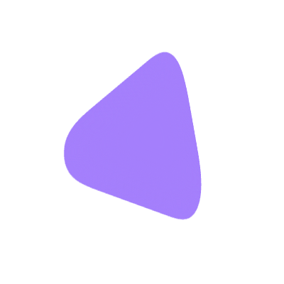

<div align="center">

#  Pebble

A lightweight, always-on-top AI overlay for your desktop.<br />
Press <kbd>Alt</kbd>+<kbd>Space</kbd> anywhere, ask anything, get a streamed answer — then press <kbd>Escape</kbd> to dismiss.

<br>

<table>
  <tr>
    <td align="center">
      <a href="https://github.com/NuclearVenom/Pebble/releases/download/v1.0.0/Pebble_1.0.0_x64-setup.exe">
        
      </a>
    </td>
    <td align="center">
      <a href="https://github.com/NuclearVenom/Pebble/releases/download/v1.0.0/Pebble_1.0.0_x64_en-US.msi">
        
      </a>
    </td>
  </tr>
</table>

<br>

<a href="https://github.com/NuclearVenom/Pebble/releases/latest">
  </a>
<a href="LICENSE"></a>
<a href="https://github.com/NuclearVenom/Pebble/issues"></a>
</div>
<br>

>**Note:** Windows may display a security warning because this experimental beta is not currently digitally signed. Only install Pebble builds obtained directly from this repository.

---

## Table of Contents

- [ Pebble](#-pebble)
  - [Table of Contents](#table-of-contents)
  - [What is Pebble?](#what-is-pebble)
  - [Key Features](#key-features)
  - [Installation](#installation)
    - [Download a pre-built release (recommended)](#download-a-pre-built-release-recommended)
    - [Build from source](#build-from-source)
  - [API Key Setup](#api-key-setup)
    - [1. Create a Groq API Key](#1-create-a-groq-api-key)
    - [2. Set the API Key](#2-set-the-api-key)
      - [Windows — PowerShell](#windows--powershell)
      - [Windows — Command Prompt](#windows--command-prompt)
      - [Linux / macOS](#linux--macos)
    - [3. Using Multiple API Keys](#3-using-multiple-api-keys)
    - [Protecting Your API Key](#protecting-your-api-key)
  - [Quick Start](#quick-start)
  - [Building from Source](#building-from-source)
    - [Prerequisites](#prerequisites)
    - [Run in development mode](#run-in-development-mode)
    - [Build a release bundle](#build-a-release-bundle)
  - [Architecture](#architecture)
    - [Rust backend](#rust-backend)
    - [Window layout](#window-layout)
    - [Streaming](#streaming)
    - [Markdown + LaTeX](#markdown--latex)
    - [Copy buttons](#copy-buttons)
    - [Web search](#web-search)
    - [API key fallback](#api-key-fallback)
    - [A documented gotcha for contributors](#a-documented-gotcha-for-contributors)
  - [Rich Content Rendering](#rich-content-rendering)
  - [Chat Mode](#chat-mode)
  - [Dashboard](#dashboard)
  - [Auto-Updater](#auto-updater)
  - [Notes and Known Caveats](#notes-and-known-caveats)
  - [Security](#security)
  - [Configuration](#configuration)
  - [Roadmap](#roadmap)
  - [Contributing](#contributing)
  - [License](#license)
  - [Citation](#citation)
  - [Acknowledgements](#acknowledgements)

---

## What is Pebble?

Pebble is a desktop utility that surfaces an AI assistant as a small, transparent, always-on-top overlay — no browser tab, no app window, no taskbar entry. A global keyboard shortcut (`Alt+Space`) pops it into view wherever you are, you type, and a streamed answer appears below. Press `Escape` and it vanishes completely.

Beyond plain question-and-answer, Pebble renders **rich content blocks** — math with quantum notation, chemical equations, 2D molecules, function plots, data charts, diagrams, geographic maps, 3D molecular structures, phylogenetic trees, chess positions, and more — each loaded on demand, only when a block of that type actually appears. None of these libraries are bundled at startup.

Pebble also includes **web search**, **multi-turn chat mode**, **persistent chat history**, and an in-app **automatic updater**.

---

## Key Features

- **Global shortcut** — `Alt+Space` opens Pebble from any application; `Escape` closes it
- **Streamed responses** — answers appear word-by-word as they arrive from the Groq API
- **Rich content rendering** — 17+ semantic block types (math, chemistry, diagrams, maps, 3D structures, …) loaded lazily on demand
- **Web search** — automatically triggered for time-sensitive or lookup queries; can also be forced manually
- **Chat mode** — multi-turn conversation with token-budget tracking and automatic turn eviction
- **Persistent chat history** — saves and restores conversations across sessions via localStorage
- **API key fallback** — supports multiple `GROQ_API_KEY*` environment variables and falls back automatically if one fails
- **Automatic updates** — checks GitHub Releases every 6 hours; shows an in-app update bar with one-click install
- **Frosted-glass UI** — transparent, undecorated window with `backdrop-filter` blur; no taskbar entry, no window chrome
- **No bundler, no build step** — plain HTML/CSS/JS loaded as ES modules; `cargo tauri dev` is the only command you need

---

## Installation

### Download a pre-built release (recommended)

Download the installer for your platform from the [latest release](https://github.com/NuclearVenom/Pebble/releases/latest) or by clicking the button above:

| Platform | Installer |
|---|---|
| Windows | `.exe` / `.msi` installer |
| macOS | `.dmg` disk image |
| Linux | `.AppImage` / `.deb` |

> **Note:** macOS builds are not notarised. You may need to right-click → Open on first launch.

### Build from source

See [Building from source](#building-from-source) below.

---

## API Key Setup

Pebble currently uses the **Groq API** to generate AI responses. You need at least one Groq API key before using Pebble.

### 1. Create a Groq API Key

Create an API key from the [Groq Console](https://console.groq.com/keys).

Sign in to your Groq account (or create one), create a new API key, and copy it.

> **Keep your API key private.** Never publish it, commit it to GitHub, include it in screenshots, or share it with anyone else.

### 2. Set the API Key

Pebble reads API keys from your operating system's environment variables.

The primary variable is:

```text
GROQ_API_KEY
```

#### Windows — PowerShell

Open PowerShell and run:

```powershell
setx GROQ_API_KEY "gsk_your_key_here"
```

Replace `gsk_your_key_here` with your actual API key.

For example:

```powershell
setx GROQ_API_KEY "gsk_XXXXXXXXXXXXXXXXXXXXXXXX"
```

`setx` saves the variable for future processes. **Completely close and reopen Pebble** after setting the key. You may also need to open a new terminal window before the variable becomes available there.

To verify it from a new PowerShell window:

```powershell
$env:GROQ_API_KEY
```

#### Windows — Command Prompt

You can use the same `setx` command from Command Prompt:

```cmd
setx GROQ_API_KEY "gsk_your_key_here"
```

Then open a new Command Prompt window and verify it with:

```cmd
echo %GROQ_API_KEY%
```

#### Linux / macOS

Add the variable to your current shell session:

```bash
export GROQ_API_KEY="gsk_your_key_here"
```

To make it persistent, add the same line to your shell's startup file, such as `~/.bashrc`, `~/.zshrc`, or the appropriate configuration file for your shell.

Then restart Pebble from a process that has access to the updated environment.

### 3. Using Multiple API Keys

Pebble supports multiple Groq API keys for automatic fallback.

Any environment variable whose name begins with `GROQ_API_KEY` is detected, for example:

```text
GROQ_API_KEY
GROQ_API_KEY_1
GROQ_API_KEY_2
GROQ_API_KEY_BACKUP
```

Pebble sorts the discovered variables and tries them in order. If a key is invalid, unauthorised, rate-limited, or otherwise rejected, Pebble automatically attempts the next available key.

For example, on Windows:

```powershell
setx GROQ_API_KEY "gsk_primary_key"
setx GROQ_API_KEY_1 "gsk_backup_key"
setx GROQ_API_KEY_2 "gsk_another_backup_key"
```

A failed key is **not permanently blacklisted**. Every new question starts with a fresh attempt, allowing a temporarily rate-limited key to be used again later.

### Protecting Your API Key

Pebble reads API keys from your operating system environment and does not write their values to disk. Key values are masked when displayed in Pebble's dashboard.

**Never commit API keys to the repository or include them in bug reports, screenshots, logs, or public discussions.**

If you suspect that a key has been exposed, revoke it from the [Groq Console](https://console.groq.com/keys) and create a new one.


## Quick Start

1. Set your Groq API key:

   ```bash
   # Linux / macOS
   export GROQ_API_KEY=gsk_...

   # Windows (PowerShell)
   $env:GROQ_API_KEY = "gsk_..."
   ```

2. run the Pebble app.
3. Press `Alt+Space` to open Pebble.
4. Type your question and press `Enter`.
5. Press `Escape` to dismiss.

**Multiple API keys:** Any environment variable whose name starts with `GROQ_API_KEY` is picked up automatically — `GROQ_API_KEY`, `GROQ_API_KEY_1`, `GROQ_API_KEY_BACKUP`, etc. Pebble tries them in sorted order and falls through to the next if one is invalid, rate-limited, or otherwise rejected. Each key gets a fresh attempt on every new question (rate limits are often transient).

---

## Building from Source

### Prerequisites

- **Rust + Cargo** (stable, 1.77+) — [rustup.rs](https://rustup.rs)
- **Tauri CLI v2** — `cargo install tauri-cli --version "^2.0"`
- **A Groq API key** set as `GROQ_API_KEY` in your environment ([console.groq.com/keys](https://console.groq.com/keys))
- **An internet connection** — Pebble loads `marked` and `KaTeX` from jsDelivr on first use and calls the Groq API directly
- Platform system dependencies for Tauri (Linux only — see [Tauri prerequisites](https://tauri.app/start/prerequisites/))

There is no `npm install` step. The frontend is plain HTML/CSS/JS with no build tool.

### Run in development mode

```bash
cargo tauri dev
```

Run from the project root. This compiles the Rust backend and opens the Pebble window. The frontend is served directly from `src/` with no build step.

### Build a release bundle

```bash
cargo tauri build
```

Produces platform-native installers in `src-tauri/target/release/bundle/`.

> **Tip:** Pebble uses aggressive release-profile settings (`opt-level = "z"`, `lto = true`, `strip = true`) for a minimal binary size.

---

## Architecture

```
pebble/
├── src-tauri/          Rust / Tauri backend
│   ├── src/main.rs     Global shortcut, Tauri commands, auto-updater plugin
│   ├── tauri.conf.json Window config, updater endpoint
│   └── capabilities/   Tauri permission declarations
└── src/                Frontend (plain HTML/CSS/JS — no bundler)
    ├── index.html      Window markup
    ├── style.css       All styles
    ├── main.js         Core logic — streaming, markdown/LaTeX, geometry, Groq
    ├── web-search.js   Web search heuristics, citation extraction
    ├── chat-store.js   Persistent chat history (localStorage)
    ├── updater.js      Auto-update logic (Tauri plugin-updater)
    ├── clipboard.js    Shared copy-button widget
    └── renderers/      Rich content block system
        ├── blocktypes.js   Central type catalog
        ├── registry.js     Lazy module loading + render cache
        ├── catalog.js      Wires each type to its module
        ├── shell.js        Shared block UI + viewport gating
        └── <name>/         One folder per renderer
```

### Rust backend

The Rust side (`src-tauri/`) is deliberately thin. It owns three responsibilities:

1. **Global shortcut** — registers `Alt+Space` OS-wide via `tauri-plugin-global-shortcut`; emits a `toggle-widget` event to the frontend when pressed. The frontend owns all show/hide/positioning logic.
2. **Tauri commands** exposed to the frontend:
   - `get_groq_keys` — scans the environment for every variable starting with `GROQ_API_KEY`, sorted for a stable order
   - `open_url` — opens a URL in the system browser; restricted to `http`/`https` only
   - `get_app_version` — returns the current version from `Cargo.toml`
3. **Auto-updater** — loaded via `tauri-plugin-updater`; the check/download/install logic lives in `src/updater.js`

### Window layout

The window is transparent, undecorated, always-on-top, and hidden from the taskbar/dock. It starts hidden and is shown/positioned/resized entirely from JS via the Tauri window API (exposed globally as `window.__TAURI__` since there's no bundler to import from `@tauri-apps/api`).

- **Two separate shapes** — the capsule (input) and the panel (answer) are independent floating pieces with a real gap, not one merged card. `#panel`'s `overflow: hidden` clips the scrollbar to the rounded corners.
- **Positioning** — the capsule is horizontally centred and sits 20% from the top of the current monitor. Only the window's *height* changes as content grows — the top-left corner never moves. Growth is capped at 90% of screen height; past that the panel scrolls internally.
- **Dashboard** — the capsule itself morphs downward (not a separate element) when you click the logo, using the same height-transition approach the answer panel already uses. The search input and a "Pebble" title crossfade in the same slot, so opening the dashboard replaces the search bar rather than just adding content below it.

### Streaming

The frontend calls the Groq Chat Completions endpoint directly with `stream: true` and parses the server-sent events itself — no extra dependency. A system prompt is sent with every request identifying the model as "Pebble", crediting the creator, and pointing to the GitHub repository — see `SYSTEM_PROMPT` in `main.js`.

### Markdown + LaTeX

`$…$`, `$$…$$`, `\(…\)`, and `\[…\]` are extracted from the raw text before it goes to `marked`, rendered with KaTeX, then spliced back in. This prevents markdown's emphasis rules (`_`, `*`) from mangling expressions like `$x_i$`. Each match is bounded to a single paragraph so a dropped closing delimiter only affects that paragraph.

### Copy buttons

The response is rendered block-by-block via `marked`'s lexer, so each top-level block — paragraph, list, table, blockquote, or code block — carries its own hover-revealed copy button. Code blocks copy the exact fenced source; all other blocks copy the raw markdown (including original LaTeX delimiters, not rendered symbols). A separate always-present button copies the whole response.

### Web search

`web-search.js` uses a regex-based heuristic on the prompt text — zero API calls, zero tokens — to decide whether the query needs current information. If so, the request is sent with Groq's built-in `browser_search` tool. The user can also force search on any response via the panel action button. Citations from the response are rendered as a collapsible source list; clicking a source opens it in the system browser.

### API key fallback

`get_groq_keys` returns every environment variable starting with `GROQ_API_KEY`, sorted for a stable order. Each question tries them in that order and uses the first one that returns a successful response — a key that's invalid, unauthorised, or rate-limited falls through to the next, with no permanent blacklisting (rate limits are transient, so every key gets a fresh attempt on the next question).

### A documented gotcha for contributors

`.dash-keys-list` used to have its own `transition: height`. Expanding the key list measured `dashboard-content`'s `scrollHeight` immediately after setting that height, but a CSS transition doesn't jump to its target value — the element was still animating from ~0 at the exact synchronous moment JS read it, so the capsule kept sizing for a list that hadn't grown yet. Fixed by removing that inner transition entirely; `#capsule`'s own height transition provides the smooth growth and the inner element snaps instantly so it can be measured accurately. **Any future element whose size needs to be measured and immediately used to size something else should not itself have a competing `transition` on the property being measured.**

---

## Rich Content Rendering

Pebble recognises a vocabulary of **semantic fenced code blocks** and routes each to a dedicated renderer instead of showing plain code. Renderers are lazy-loaded on demand — none of these libraries load at startup.

| Fence | Renders | Status | Library |
|---|---|---|---|
| ` ```math ` (or ` ```latex `, ` ```tex `) | LaTeX math — braket/quantum notation, SI-unit macros | Full | KaTeX |
| ` ```chem ` (or `\ce{...}` inline anywhere) | mhchem chemistry equations | Full | KaTeX + mhchem |
| ` ```molecule ` (or ` ```smiles `) | 2D molecular structure from SMILES | Full | SmilesDrawer |
| ` ```svg ` | Sanitised inline SVG illustration | Full | DOMPurify |
| ` ```mermaid ` | Flowcharts, sequence/class/state/ER diagrams | Full | Mermaid |
| ` ```plot ` (or ` ```chart `) | Function/line/scatter/bar charts from a JSON spec | Full | Chart.js |
| ` ```dot ` (or ` ```graphviz `) | Graphviz graph from DOT source | Full | @viz-js/viz (WASM) |
| ` ```fasta ` | DNA/RNA/protein sequence viewer | Full | none (native) |
| ` ```newick ` | Phylogenetic tree | Full | none (native) |
| ` ```geojson ` | Interactive vector map | Full | Leaflet |
| ` ```pdb ` (or ` ```mmcif `) | Interactive 3D molecular structure | Full | 3Dmol.js |
| ` ```fen ` | Static chess position | Full | none (native) |
| ` ```pgn ` | Chess game — move list + final position | Partial | chess.js |
| ` ```chemfig ` | Structural formula (needs TeX engine) | Placeholder | — |
| ` ```tikz ` | TikZ diagram (needs TeX engine) | Placeholder | — |
| ` ```circuit ` | CircuiTikZ circuit (needs TeX engine) | Placeholder | — |
| ` ```cif ` | Crystal structure | Placeholder | — |
| ` ```lilypond ` | Sheet music | Placeholder | — |
| ` ```fits ` | Astronomical image data | Placeholder | — |

**Placeholder** blocks show the original source with an explanation rather than a partial rendering.

The system prompt currently teaches the model a curated subset — `math`, `chem`, `molecule`, `mermaid`, and `plot` — rather than all working types. This is deliberate: a model reaching for a fence it uses inconsistently produces a worse result than not reaching for it at all. The remaining renderers still work when a fenced block names them; they're just not actively encouraged until their reliability has been verified in the same way. See [`docs/RENDERERS.md`](docs/RENDERERS.md#current-system-prompt-scope-separate-from-renderer-status) for the reasoning.

For the full renderer architecture, security model, lazy-loading internals, viewport gating, and instructions for adding a new renderer, see [`docs/RENDERERS.md`](docs/RENDERERS.md).

---

## Chat Mode

Press **Continue conversation** after a response to enter multi-turn chat mode:

- Subsequent questions extend the same conversation thread
- The panel footer shows an estimated token counter
- Older turns are automatically evicted once the estimated context approaches ~95 k tokens
- Save with the **Save** button, or enable **Auto-save** in the dashboard for automatic saving

Saved chats are stored in localStorage (up to 50 chats). The dashboard shows a collapsible saved-chat list with timestamps and delete buttons.

---

## Dashboard

Click the Pebble logo to open the dashboard — the capsule morphs downward to reveal:

- **Developer credit** and live Groq API status (checked on open, not continuously)
- **GitHub** button — opens the repository in your system browser
- **Check for update** button — triggers an immediate update check regardless of the 6-hour throttle
- **API keys** — collapsible list of every `GROQ_API_KEY*` variable found (values masked: first 6 + last 4 characters)
- **Auto-save chats** toggle
- **Saved chats** — collapsible list with timestamps and delete buttons

Click the logo again (or press `Escape`) to close the dashboard.

---

## Auto-Updater

Pebble checks for new releases every 6 hours via the GitHub Releases endpoint. When a new version is found:

- An **update bar** appears above the capsule (only when the widget is open — never an intrusive popup)
- Click **Update now** to download and install; progress is shown inline
- The app restarts automatically after installation
- Trigger a manual check any time from the **Check for update** button in the dashboard

Updates are verified with a minisign public key embedded in `tauri.conf.json`. The endpoint is:

```
https://github.com/NuclearVenom/Pebble/releases/latest/download/latest.json
```

> **Note:** The updater returns no result in `cargo tauri dev`. The update bar only appears in production builds.

---

## Notes and Known Caveats

- **Stateless by default** — each `Enter` sends a fresh, independent request unless chat mode is active. Asking a new question while one is still streaming cancels the old one.
- **Resets on close** — `Alt+Space` again (or `Escape`) always resets to a fresh state.
- **No key found** — if no `GROQ_API_KEY*` variable is found, the panel reports this on the first submission.
- **All keys fail** — if several keys are found and all fail, the error shown is from the last one tried.
- **Logo is a pre-rasterised PNG** (`src/logo.png`) — the SVG's blur+threshold filter distorts at ~19 px in the webview, so it's baked in at high resolution and scaled down as a normal image. `src-tauri/icons/` was generated from `src/pebble-logo.svg` by the same process.
- **Math paragraph bounding** — `\(…\)` / `\[…\]` / `$$…$$` are each bounded to a single paragraph. A dropped closing delimiter only affects one paragraph rather than swallowing everything up to the next delimiter.
- **Windows: transparent window fringing** — there is a known upstream Tauri/WebView2 issue ([#11321](https://github.com/tauri-apps/tauri/issues/11321), [#8308](https://github.com/tauri-apps/tauri/issues/8308)) where transparent windows with rounded corners can show a faint antialiased fringe. Pebble uses a crisp 1 px hairline instead of a blurred drop shadow to minimise this, and `"backgroundColor": "#0f0f11"` is set explicitly. If you still see fringing, this is the upstream cause.
- **Windows: native title bar** — `decorations: false` + `shadow: false` has a known issue on some setups ([#14859](https://github.com/tauri-apps/tauri/issues/14859)). Try `"shadow": true` in `src-tauri/tauri.conf.json` as a workaround.
- **Frosted-glass blur** — depends on your OS/compositor supporting `backdrop-filter` for a transparent window. On Linux without compositing it renders as a flat dark-tinted shape instead — it still looks correct.
- **Copying non-code blocks** copies the original markdown source (including LaTeX delimiters), not plain rendered text. This avoids content duplication where KaTeX embeds both a visual rendering and a hidden MathML annotation.
- **GeoJSON tiles** — the `geojson` renderer has no default tile provider, so it renders vector geometry without any network request. A tile layer can be configured separately. The renderer briefly attaches the map to a hidden off-screen element to measure it correctly; `map.invalidateSize()` is called once it's in its final place — worth a check if a map ever renders with the wrong size.
- **Chemistry inline detection** — `\ce{...}` and `\pu{...}` are found by scanning raw response text directly (not only through the ` ```chem ` fence), so chemistry renders correctly even written inline, in single-backtick code, or inside a table cell.
- **`chemfig` / `tikz` / `circuit`** — these require a full TeX engine (realistically a WASM LaTeX build). They are registered as placeholders; `svg` is the practical stand-in for hand-authored diagrams.

---

## Security

- **API keys** are read from your OS environment and never written to disk by Pebble. Key values are masked in the dashboard UI.
- **`open_url`** is restricted to `http://` and `https://` only — it cannot launch local programs or arbitrary URI schemes.
- **SVG blocks** are sanitised through DOMPurify with an explicit config blocking `<script>`, `<foreignObject>`, `<iframe>`, `<embed>`, `<object>`, `on*` handlers, and `javascript:` hrefs.
- **Mermaid** is initialised with `securityLevel: "strict"`, disabling raw HTML labels and script execution inside diagrams.
- **Plot expression evaluation** uses a small hand-written recursive-descent parser — not `eval()` or `new Function()`. It has no access to JS globals or the DOM.
- **Updates** are verified with a minisign public key before installation.
- **Tauri capabilities** (`capabilities/default.json`) explicitly enumerate every permission the frontend may use.
- **CSP** is currently set to `null` in `tauri.conf.json`. The application loads scripts from jsDelivr CDN at runtime; a stricter CSP would require bundling those libraries.

See [SECURITY.md](SECURITY.md) to report a vulnerability.

---

## Configuration

Pebble has no configuration file. Everything is controlled via:

| Method | What it configures |
|---|---|
| `GROQ_API_KEY` (environment variable) | Primary Groq API key |
| `GROQ_API_KEY_*` (any suffix) | Additional fallback keys |
| Dashboard UI | Auto-save preference |
| `src-tauri/tauri.conf.json` | Window properties, update endpoint, CSP |

---

## Roadmap

Pebble's roadmap is intentionally capability-oriented rather than release-oriented. Features may be introduced incrementally and in an order determined by development priorities, stability, and technical dependencies.

**Planned future capabilities:**

- More advanced glassmorphism / liquid-glass UI and floating panels
- Offline and local LLM support
- Support for multiple AI providers — Gemini, OpenRouter, additional Groq models, and others
- Flexible model and provider selection from the UI
- A more capable multi-turn AI agent with broader tool-use awareness
- Remote tool execution and more advanced tool orchestration
- Ability for the AI to work with files and folders where explicitly permitted
- A larger and more discoverable renderer ecosystem
- Move-by-move chess game replay (completing the `pgn` renderer)
- Full implementations of deferred renderers (`chemfig`, `tikz`, `circuit`, `cif`, `lilypond`) as suitable lightweight engines become available

---

## Contributing

Contributions are welcome. Please read [CONTRIBUTING.md](CONTRIBUTING.md) before submitting a pull request.

---

## License

MIT — see [LICENSE](LICENSE).

---

## Citation

If you use Pebble in published work, you can cite it as:

```bibtex
@software{pebble2026,
  author  = {Ghosh, Ranasurya},
  title   = {Pebble: A Lightweight Always-On-Top AI Desktop Overlay},
  year    = {2026},
  version = {1.0.0},
  url     = {https://github.com/NuclearVenom/Pebble}
}
```

Or see [CITATION.cff](CITATION.cff) for a machine-readable citation.

---

## Acknowledgements

Pebble is built on top of a number of excellent open-source libraries and services:

- [Tauri](https://tauri.app) — Rust/WebView desktop framework
- [Groq](https://groq.com) — AI inference API
- [KaTeX](https://katex.org) — LaTeX math rendering
- [marked](https://marked.js.org) — Markdown parsing
- [Mermaid](https://mermaid.js.org) — diagram rendering
- [Chart.js](https://www.chartjs.org) — charting
- [SmilesDrawer](https://github.com/reymond-group/smilesDrawer) — 2D molecular structures
- [3Dmol.js](https://3dmol.csb.pitt.edu) — 3D molecular visualization
- [Leaflet](https://leafletjs.com) — interactive maps
- [@viz-js/viz](https://github.com/nicktindall/viz.js) — WASM Graphviz layout
- [chess.js](https://github.com/jhlywa/chess.js) — chess PGN parsing
- [DOMPurify](https://github.com/cure53/DOMPurify) — SVG sanitisation

---

<br>
<p align="center">Developed and maintained by <strong>Ranasurya Ghosh</strong><br />
<a href="https://github.com/NuclearVenom/Pebble">github.com/NuclearVenom/Pebble</a></p>
