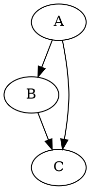

# Pebble's rich content rendering engine

Pebble renders ordinary Markdown and LaTeX the way it always has. On top of
that, it recognizes a fixed vocabulary of **semantic fenced code blocks** —
` ```mermaid `, ` ```chem `, ` ```molecule `, etc. — and hands each one to a
dedicated renderer instead of displaying it as plain code. This document
describes that system: what's supported, how it's built, and how to add to
it.

## Supported block types

| Fence | Renders | Status | Library (lazy-loaded) |
|---|---|---|---|
| ` ```math ` | LaTeX math, incl. braket/quantum notation and SI-unit-style macros | Full | KaTeX (already loaded for inline math) |
| ` ```chem ` | mhchem equations (`\ce{...}`) — also detected directly in prose/tables, not just this fence | Full | KaTeX + `contrib/mhchem` (loaded eagerly, not lazily — see note below) |
| ` ```molecule ` (alias `smiles`) | 2D structure from a SMILES string | Full | SmilesDrawer |
| ` ```svg ` | Sanitized inline vector illustration | Full | DOMPurify |
| ` ```mermaid ` | Flowcharts, sequence/class/state/ER diagrams, etc. | Full | Mermaid |
| ` ```plot ` (alias `chart`) | Function/line/scatter/bar charts from a JSON spec | Full | Chart.js |
| ` ```dot ` (alias `graphviz`) | Graphviz-layout graphs, from DOT source | Full | `@viz-js/viz` (WASM Graphviz) |
| ` ```fasta ` | DNA/RNA/protein sequence viewer | Full | none (native) |
| ` ```newick ` | Phylogenetic tree | Full | none (native) |
| ` ```geojson ` | Interactive vector map | Full | Leaflet |
| ` ```pdb ` (alias `mmcif`) | Interactive 3D molecular structure | Full | 3Dmol.js |
| ` ```fen ` | Static chess position | Full | none (native) |
| ` ```pgn ` | Chess game — move list + final position | Partial (no move-by-move replay yet) | chess.js |
| ` ```chemfig ` | Structural chemistry diagrams | Placeholder | — |
| ` ```tikz ` | General TikZ diagrams | Placeholder | — |
| ` ```circuit ` (alias `circuitikz`) | Circuit diagrams | Placeholder | — |
| ` ```cif ` | Crystal structures | Placeholder | — |
| ` ```lilypond ` | Sheet music | Placeholder | — |
| ` ```fits ` | Astronomical image data | Placeholder | — |

"Placeholder" blocks show the original source and an explanation instead of
attempting to render — see [Deferred renderers](#deferred-renderers-and-why)
below for why each one is deferred rather than half-implemented.

This table is generated by hand to match
[`src/renderers/blocktypes.js`](../src/renderers/blocktypes.js), which is
the actual single source of truth the code reads from (the parser, the
registry, and the system prompt all derive from that file, not from this
document — if they ever disagree, blocktypes.js is correct and this file is
stale).

## Syntax examples

**Math** (this is also where braket notation and the unit macros live —
there's no separate fence for those):

````
```math
|\psi\rangle = \alpha\ket{0} + \beta\ket{1}
\qquad \bra{\psi}\hat H\ket{\psi}
```
````

**Chemistry:**

````
```chem
\ce{CaCO3 ->[heat] CaO + CO2}
```
````

Chemistry is handled differently from every other renderer, and deliberately
so: `\ce{...}`/`\pu{...}` are detected by scanning the raw response text
directly (`extractChem()` in `main.js`), the same way inline `$math$` is —
*not* only through the ```chem fence above. In practice, models are
noticeably less consistent about reaching for a custom fence like ```chem
than they are about writing `\ce{...}` at all (it's standard mhchem
syntax, seen constantly in training data); they'll write it inline
mid-sentence, wrap it in single-backtick inline code, or — the case that
actually motivated this — try to cram a multi-line fenced block into a
single markdown table cell, which can't work syntactically and just shows
up as broken literal text. Scanning raw text sidesteps all of that: it
finds `\ce{...}` wherever it is (handling nested braces correctly, e.g.
`Fe^{3+}` or `[Cu(NH3)4]^2+`) and renders it in place, stripping a single
surrounding backtick pair if present. The ```chem fence still works too
(useful for a reaction the model wants to present as its own standalone
block) and goes through the same underlying KaTeX call.

One consequence: `contrib/mhchem` is loaded **eagerly** in `index.html`
(right alongside KaTeX itself), not lazily like every other renderer. It's
a small file, and the reliability of "chemistry always renders, with zero
loading state, exactly like math" was judged worth a small fixed cost —
see the comment in `index.html` and `renderers/math/chem.js`.

**Molecule (SMILES):**

````
```molecule
CC(=O)OC1=CC=CC=C1C(=O)O
```
````

**Plot** (function series and explicit-data series can be mixed):

```json
{
  "type": "function",
  "title": "Damped oscillation",
  "xLabel": "t", "yLabel": "x(t)",
  "expression": "sin(x) * exp(-x/5)",
  "xMin": 0, "xMax": 20
}
```

Multiple function curves together — the outer `"type"` is a hint, not a
strict switch: `buildDatasets()` in `renderers/plot/index.js` decides
*per series* whether to sample an expression or plot explicit data, based
on which fields that series actually has. A series with `"expression"`
samples as a function even if the outer `"type"` says `"line"`, which is
an easy, harmless thing for a model to get slightly wrong when mixing
formula series with data series:

```json
{
  "type": "function",
  "xLabel": "I (A)", "yLabel": "V (V)",
  "xMin": 0, "xMax": 0.5,
  "series": [
    { "label": "10 Ω", "expression": "10*x" },
    { "label": "50 Ω", "expression": "50*x" }
  ]
}
```

**Graph (DOT):**

````

````

Everything else in the table follows its format's normal conventions
(standard Mermaid syntax, standard FASTA/Newick/FEN/PGN text, a raw
`<svg>...</svg>` element, a raw GeoJSON Feature/FeatureCollection, raw PDB
or mmCIF text).

## Architecture

```
src/
  renderers/
    blocktypes.js   — the type catalog (id, aliases, label, status, "heavy" flag)
    registry.js      — lazy module loading (memoized) + render cache
    catalog.js        — wires each type to its module via () => import(...)
    shell.js           — the shared Rich Content Block UI + viewport gating
    loader-utils.js      — loadScript()/loadStylesheet() for classic CDN builds
    math/                — macros.js (braket/siunitx-lite), chem.js (mhchem)
    mermaid/, molecule/, svg/, plot/, graphviz/, fasta/, newick/,
    geo/, molecular3d/, chess/, tikz/, circuit/, chemfig/, crystal/,
    music/, fits/         — one module per renderer
  main.js                 — streaming, markdown/block parsing, geometry, Groq
  clipboard.js            — shared copy-button widget
```

Every renderer module's default export matches:

```ts
interface ContentRenderer {
  type: string;
  render(source: string, options?: object): Promise<RenderedContent>;
}

type RenderedContent =
  | { kind: "node"; node: Node }
  | { kind: "html"; html: string };
```

`render()` should just `throw` on failure with a clear message — the shell
turns that into the standard error card (message + original source + retry
button). Nothing else needs a try/catch of its own.

### How a block goes from streamed text to pixels

1. `main.js`'s `renderOutput()` re-lexes the accumulated response with
   `marked.lexer()` on every streamed update (as it always has).
2. For each `code`-type token, its language is checked against
   `blocktypes.js` via `resolveBlockType()`. No match → the existing plain
   code-block path, unchanged.
3. A match, but the fence hasn't closed yet (still streaming) → a cheap,
   static "Generating…" placeholder. No renderer code runs.
4. A match and the fence is closed → `math` is rendered directly through
   the same synchronous KaTeX call as inline/`$$` math (it's fast enough
   that the async machinery below is unnecessary overhead). Everything
   else goes to `renderers/shell.js`'s `mountBlock()`.
5. `mountBlock()` checks the render cache (`hash(type + source)`). A hit
   applies the cached result immediately. A miss shows a loading state,
   then — for renderers flagged `heavy` in blocktypes.js — waits for an
   `IntersectionObserver` to report the block is within ~200px of the
   viewport before doing anything else.
6. Once triggered: `registry.js` dynamically `import()`s the renderer
   module (memoized — a second block of the same type in the same session
   reuses the already-loaded module and whatever CDN library it loaded).
7. `renderer.render(source, options)` runs, its result is cached, and
   inserted into the block's body. A `pebble:block-resize` event bubbles up
   so `main.js` can re-measure and resize the native window.

### Adding a renderer

1. Add an entry to `BLOCK_TYPES` in `blocktypes.js` (`type`, `label`,
   `status`, `heavy`, a short `note`).
2. Create `renderers/<name>/index.js` exporting `{ type, render }`.
3. Register it in `catalog.js`: `registerLazy("<type>", () =>
   import("./<name>/index.js"));`

That's it — the parser, the shell, the cache, and (once someone updates the
system prompt's block-type list, which reads from `blocktypes.js`
automatically) the model's own awareness of the format all pick it up with
no other changes.

## Lazy loading — how "zero cost until used" actually works

Pebble has no bundler (see the main README) — it's plain `<script
type="module">` + relative `import` statements, served as-is. That turns
out to be an advantage here: dynamic `import()` of a relative module path
is natively lazy in every modern browser engine — the file isn't fetched,
parsed, or executed until the `import()` call actually happens. So:

- `main.js` statically imports `renderers/catalog.js`. That file itself is
  trivial (just type strings and `() => import(...)` closures) — none of
  those closures are *called* at that point, so nothing beyond
  `catalog.js`'s own few hundred bytes loads at startup.
- The first time a block of a given type appears, `registry.js` calls that
  type's loader, which fetches `renderers/<name>/index.js`. *That* module
  is what pulls in the actual third-party library — either via another
  `import()` of a CDN ESM build (Mermaid, `@viz-js/viz`, chess.js), or via
  `loadScript()` injecting a `<script>` tag for libraries that only ship a
  classic UMD/IIFE build (KaTeX's mhchem extension, DOMPurify,
  SmilesDrawer, Chart.js, Leaflet, 3Dmol.js).
- Both loading paths are memoized (`registry.js`'s `entry.loading` promise,
  `loader-utils.js`'s `loadedScripts` map), so a second block of the same
  type — even in a different message — reuses what's already loaded rather
  than re-fetching.

A plain-Markdown-and-a-little-math conversation therefore never touches
Mermaid, Chart.js, Leaflet, 3Dmol.js, SmilesDrawer, DOMPurify, or
`@viz-js/viz` — those `import()`/`loadScript()` calls simply never happen.

### Viewport gating for the heaviest renderers

`molecule`, `plot`, `dot`, `mermaid`, `pdb`, and `geojson` are flagged
`heavy: true` in `blocktypes.js`. For those, `shell.js` doesn't even start
the load when the block is parsed — it puts up a "Waiting to load…" state
and attaches an `IntersectionObserver` (`rootMargin: "200px"`) to the
block's shell element. Only once the observer reports the block is near
the viewport does loading begin. This matters most for long, textbook-style
responses with several rich blocks scattered through a scrollable answer —
blocks the user hasn't scrolled to yet cost nothing.

## Streaming performance

An expensive renderer must not run once per streamed token. Every semantic
block is held as a static "Generating…" placeholder until its closing
fence has actually arrived in the stream (detected by counting fence-marker
lines in the block's raw matched text — marked auto-extends an unclosed
fence to end-of-input, so an in-progress block still parses as a code
token, just with only one fence line instead of two). Only once closed does
it go through the render pipeline, exactly once — and the render cache
means even a full re-render of the message (which happens on every
streamed token, same as before this feature existed) reuses the cached
result for any block whose source hasn't changed, rather than re-invoking
the renderer.

## Security

- **SVG** is the highest-risk renderer, since it's structurally HTML. It's
  sanitized through DOMPurify with an explicit config (not just default
  settings) that forbids `<script>`, `<foreignObject>`, `<iframe>`,
  `<embed>`, `<object>`, `<use>`, all `on*` event handler attributes, and
  `href`/`xlink:href` (blocking `javascript:` URLs and most avenues for
  unexpected external references) before anything touches the DOM.
- **Mermaid** is initialized with `securityLevel: "strict"`, which disables
  raw HTML labels and script execution within diagrams.
- **`plot`'s function expressions** are evaluated by a small hand-written
  recursive-descent parser (`renderers/plot/expr.js`), not `eval()` or
  `new Function()`. It has no access to any JS global, the DOM, or
  anything beyond a fixed table of math functions — there's nothing for
  hostile input to reach.
- **GeoJSON** renders with no default tile provider, so it never makes a
  network request just to display a shape — only the vector geometry the
  content itself contains.
- **Every** other renderer's raw source is escaped before ever being
  interpolated into an HTML string (`renderers/loader-utils.js`'s
  `escapeHtml`), and DOM nodes are built with `createElement`/`textContent`
  rather than string concatenation wherever practical.
- A renderer failure is caught per-block (`shell.js`'s `runRender`) and
  never propagates — the rest of the message keeps rendering normally, and
  the failing block shows its original source with a retry button.

## Deferred renderers, and why

`chemfig`, `tikz`, and `circuit` (CircuiTikZ) are all fundamentally LaTeX
packages. A faithful implementation of any of them needs an actual TeX
engine — realistically a WASM LaTeX build, which is a multi-megabyte
runtime. That's a reasonable dependency for a dedicated LaTeX-diagram tool;
it's not a reasonable thing to make every Pebble session capable of
loading by default. `svg` is the practical stand-in for hand-authored
diagrams in the meantime.

`cif` (crystallography) and `lilypond` (sheet music) are both specialized,
fairly heavy capabilities — a real CIF viewer needs unit-cell/symmetry
expansion and 3D lattice rendering, and there's no mature lightweight
browser/WASM LilyPond engine to build on today. Both are architecturally
registered (so a future implementation just drops in) but not attempted
yet, per the same reasoning as above.

`fits` was explicitly marked low-priority in the original spec and is
stubbed only for interface completeness.

`pgn` is "partial" rather than a placeholder: chess.js reliably parses the
game and produces a move list and final position, which is genuinely
useful, but move-by-move interactive replay (a position that updates as
you step through the game) isn't built yet — that's a real feature gap,
not a security or performance concern, and is the most likely of the
above to be worth finishing next.

## Current system-prompt scope (separate from renderer status)

The table above describes what the *code* supports. The system prompt
(`PRIORITY_TYPES` in `main.js`) currently teaches the model a narrower
subset — `math`, `chem`, `molecule`, `mermaid`, and `plot` — even though
`svg`, `dot`, `fasta`, `newick`, `geojson`, `pdb`, `fen`, and `pgn` all
have working renderers too. This is intentionally more conservative than
"everything that works," for a specific reason: teaching the model a
fenced-block type doesn't guarantee it'll use it correctly. In practice
the model has sometimes reached for a fence inconsistently — writing raw
HTML instead of a ```plot block, or (for chemistry, before the raw-text
detection described above existed) using inline code or breaking a fence
across a table cell. Math and mermaid have proven reliable; chemistry is
now robust against the same inconsistency by detecting it independent of
fence usage, and plot has a per-series data-vs-formula detection fix (see
its section above) addressing the specific failure mode that came up in
testing. The remaining renderers stay off the model's active vocabulary
until they get the same kind of scrutiny, rather than risk filling
ordinary responses with more broken attempts. Widening `PRIORITY_TYPES`
back out is a one-line change once each type has been verified — the
renderers themselves don't need to change.
